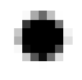

[Top level](../README.md)

# Anti-Aliasing Aware Screen Content Detection Mode

SVT-AV1 currently has two screen content detection algorithms, used to determine whether screen content tools should be enabled for a given frame (i.e. palette mode and intra block copy, or intraBC):
- `--scm 2`: a mode that works well for text and graphics with very few colors
- `--scm 3`: a more sophisticated mode that is aware of text and graphics rendered with anti-aliasing technologies (like Microsoft’s ClearType and grayscale anti-aliasing present in macOS, iOS and Android)

# Rationale

SVT-AV1's original screen content detection algorithm (`--scm 2`) has trouble detecting screen content with anti-aliased text and graphics. Usually, this kind of screen content has too many colors in total, and so the detection algorithm can get easily fooled into thinking it’s actually natural content. As a result, screen content tools end up being disabled, impacting coding efficiency.

The anti-aliasing aware screen content detection mode (`--scm 3`) addresses the aforementioned issue by first processing the image in a way that makes the screen content detection process more robust.

# Overview

The algorithm consists of the following steps:
1. Splitting the source image's luma plane into 16x16 blocks
2. Classifying each block into three main categories: simple, complex and photo-like blocks
3. Determining each block's suitability for palette mode or intra block copy (intraBC), by leveraging the block classification from 2. and per-pixel block variance
4. Tallying up each block from 3. and with a few formulas, determine if AV1 palette mode or intra block copy (intraBC) should be enabled for the entire image

# Description

## Block classification

16x16 blocks are classified in one of three categories: **simple**, **complex** and **photo-like blocks**. Determining each block's category helps finding their suitability for palette mode and intraBC.

**Simple blocks** can only have 2 to 4 distinct “colors” (in reality these are luma or brightness levels). Due to their nature, these blocks are great candidates for palette mode, so they unconditionally contribute to the palette mode count (`count_palette`).
Additionally, simple blocks with high variance (defined as having a per-pixel variance of > 5) are also considered good intraBC candidates, so they contribute to the intraBC count (`count_intrabc`).

**Complex blocks** have 5 to 40 distinct luma values. Complex blocks fall into a gray area where we can't tell if these are candidates for screen content coding without further processing.

This processing consists of performing a round of [pixel dilation](https://en.wikipedia.org/wiki/Dilation_(morphology)) with `svt_av1_dilate_block()`. This has the effect of removing most or all of the pixels around the borders of fonts or graphics used to make up the anti-aliasing effect, and greatly reduces the total color count of the block.

After the dilation round, if the block has in between 2 and 6 distinct luma values then it's considered a “proper” complex block. Complex blocks with low variance (per-pixel variance of <= 5) have been found to not be good candidates for either palette mode or intraBC coding, and so those aren't tallied up in either category. However, complex blocks with high variance (> 5) are good candidates for both palette mode (`count_palette`) and intraBC coding (`count_intrabc`).

Complex blocks with greater than 6 distinct luma values after the round of dilation are considered “unpalettizable”, and are poor candidates for both palette mode and intraBC coding.

**Photo-like blocks** have greater than 40 distinct luma values. Due to their high complexity, photo blocks are very poor candidates for both palette mode and intraBC coding. These blocks are tallied up in count_photo instead.

Note: the anti-aliasing aware screen content detection mode natively works with 8-bit buffers. 10-bit and 12-bit content is downconverted to 8 bits by taking the 8 most-significant bits of the luma channel.

# Algorithms

## Finding the dominant color

For each block, `svt_av1_find_dominant_value()` builds a histogram of luma values (0 to 255), and takes the luma value that occurs most often within the block. There's no need to break ties in any particular way – any value will work fine in practice. The current implementation just picks the first value from the tie.

## Dilation

For each block, `svt_av1_dilate_block()` finds the dominant value (i.e. the value that occurs most often within a block), then performs a round of dilation by "extending" all occurrences of the dominant value outwards in all 8 directions (4 sides + 4 corners).

To understand how dilating blocks with the dominant color helps increase the detection rate of anti-aliased text and graphics, here's a visual example. Let's have a scaled-down (9x5 pixel) version of a block containing an anti-aliased dot (•):



Let:
- `D:` the dominant value (black)
- `[a-p]:` different non-dominant values (anti-aliased pixels in various shades of gray)
- `[-]:` the second-most dominant value (white)

```
Before dilation:       After dilation:
- - a b D c d - -     - - D D D D D - -
- e f D D D g h -     D D D D D D D D D
- D D D D D D D -     D D D D D D D D D
- D D D D D D D -     D D D D D D D D D
- i j D D D k l -     D D D D D D D D D
- - m n D o p - -     - - D D D D D - -
```

As shown above, after dilating the dot with the dominant value, the pixels that make up the anti-aliasing effect are removed, leaving just the dominant (black) and the second-most dominant (white) pixels. The number of total values is reduced to just 2, which makes it more obvious to the screen content detection algorithm that the block can use screen content tools.

The dilation process works well in practice because most of the pixels that make up the anti-aliasing effect are “sandwiched” in between the anti-aliased element and the background, and do not extend beyond a 1-pixel radius. Even in the case where the dominant color is the background and the second-most dominant color is the anti-aliased element, the dilation process still eliminates anti-aliased pixels, by extending the background to the anti-aliased pixels instead of the anti-aliased element.
Formulas

Once all blocks have been tallied up for palette mode (`count_palette`) and intraBC (`count_intrabc`) suitability, and photo-like blocks (`count_photo`) are counted, the anti-aliasing aware screen content detection algorithm determines which screen content tools should be enabled with the following formulas:

```c
    // The threshold values are selected experimentally.
    // Penalize presence of photo-like blocks (1/16th the weight of a palettizable block)
    pcs->sc_class0 = ((count_palette - count_photo / 16) * blk_area * 10 > area);

    // IntraBC would force loop filters off, so we use more strict rules that also
    // requires that the block has high variance.
    // Penalize presence of photo-like blocks (1/16th the weight of a palettizable block)
    pcs->sc_class1 = pcs->sc_class0 && ((count_intrabc - count_photo / 16) * blk_area * 12 > area);

    pcs->sc_class2 = pcs->sc_class1 ||
        (count_palette * blk_area * 15 > area * 4 && count_intrabc * blk_area * 30 > area);

    pcs->sc_class3 = pcs->sc_class1 || (count_palette * blk_area * 8 > area && count_intrabc * blk_area * 50 > area);
```

There are a few remarks worth mentioning about the formulas:
- Photo-like blocks actually count *against* enabling palette mode and intraBC. This is because it has been found that having a significant number of these blocks harms overall image coding efficiency, either by an increased encoding time with no quality increase (when palette mode is on), or by an increased encoding time with a quality reduction (when intraBC is on – loop filters are forced off).
- The threshold values were determined experimentally. Hypothetically speaking, better thresholds could be found by using a bigger image corpus containing various amounts of mixed screen content and natural content.
- The AV1 specification considers palette mode as the only screen content tool. However, intraBC is also a screen content coding tool in practice.
- The threshold values are specific to AV1's palette mode and intraBC coding tools. Porting the algorithm to AV2 requires finding different thresholds as AV2's version of the coding tools has different rate/distortion tradeoffs.

Each formula follows a similar pattern. For example, let's take a look at the first one:
```c
    pcs->sc_class0 = ((count_palette - count_photo / 16) * blk_area * 10 > area);
```

To analyze this formula, let's rewrite it so it's easier to understand (excluding rounding errors caused by integer division):
```c
    pcs->sc_class0 = ((count_palette - count_photo / 16) > (0.1 * area / blk_area));
```

What this formula is calculating is that screen content class 0 (`pcs->sc_class0`) should be enabled if and only if there are at least 10% of blocks that are good candidates for palette mode, and there are not too many photo-like blocks to counteract the benefit of enabling palette mode.

## Notes

The feature settings that are described in this document were compiled at
v4.0.1 of the code and may not reflect the current status of the code. The
description in this document represents an example showing how features would
interact with the SVT architecture. For the most up-to-date settings, it's
recommended to review the section of the code implementing this feature.
